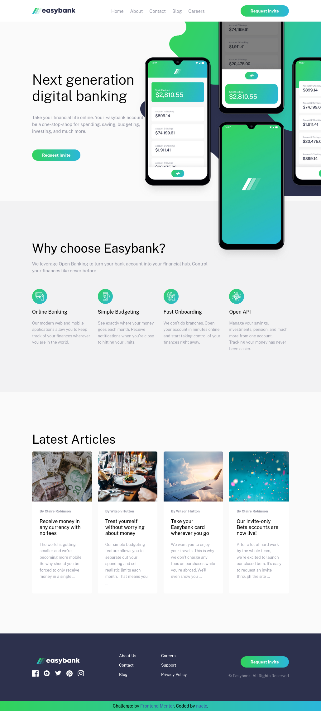

# Frontend Mentor - Easybank landing page solution

This is a solution to the [Easybank landing page challenge on Frontend Mentor](https://www.frontendmentor.io/challenges/easybank-landing-page-WaUhkoDN). Frontend Mentor challenges help you improve my frontend coding skills by building realistic projects. 

## Table of contents

- [Overview](#overview)
  - [The challenge](#the-challenge)
  - [Screenshot](#screenshot)
  - [Links](#links)
- [My process](#my-process)
  - [Built with](#built-with)
  - [What I learned](#what-i-learned)
  - [Continued development](#continued-development)
  - [Useful resources](#useful-resources)
- [Author](#author)
- [Acknowledgments](#acknowledgments)

## Overview

### The challenge

Users should be able to:

- View the optimal layout for the site depending on their device's screen size
- See hover states for all interactive elements on the page

### Screenshot

### Links
- Live Site URL: [live site URL](https://easybank-landing-page-nuelo.vercel.app/)

## My process

### Built with

- Semantic HTML5 markup
- CSS custom properties
- Flexbox
- CSS Grid
- Mobile-first workflow
- [JavaScript](https://javascript.org/) - JS library

### What I learned

A whole lot was learnt. I didn't document what was learnt but going forward will do.

### Continued development

Looking forward to implementing this whole application when i start learning frameworks like **REACT**

### Useful resources

- [google.com](https://www.google.com)
- [chatgpt](https://www.chatgpt)

## Author

- Website - coming soon
- Frontend Mentor - [@Nuelose](https://www.frontendmentor.io/profile/nuelose)
- Twitter - [@Nuelose](https://www.twitter.com/nuelose)

## Acknowledgments

Thank you to - web3bridge for making me take up this task.
